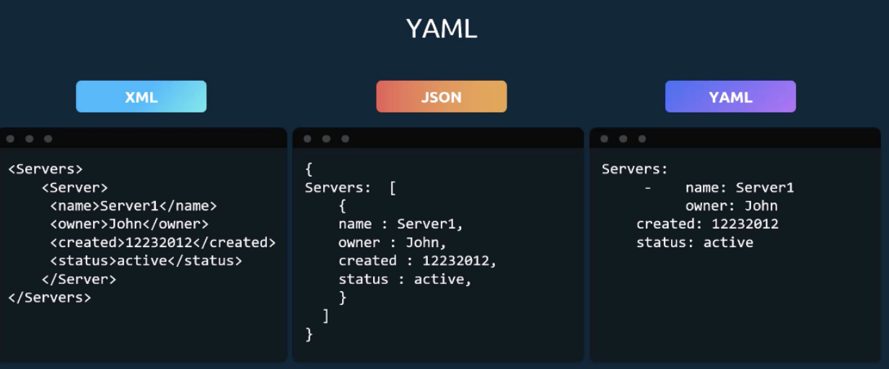
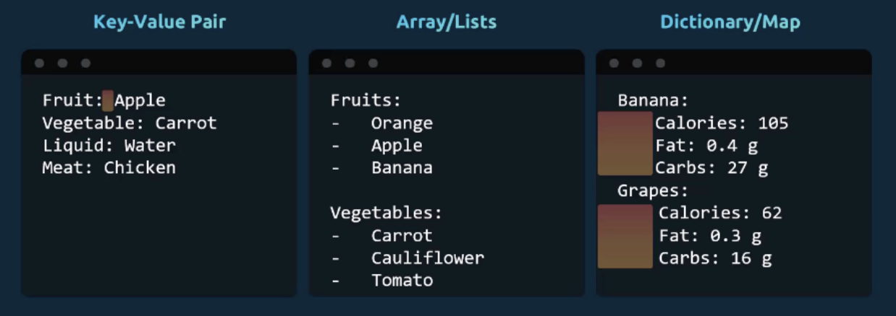
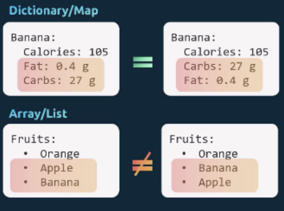

# YAML

*Yet Another Markup Language* -> *YAML Ain't Markup Language* <br>

When the language was first released in 2001, the acronym stood for "Yet Another Markup Language", but the creators later changed it to emphasize that the language is primarily designed for data rather than documents. 

A YAML file is used to represent data. 





Create an Error <br>
White Space is very important

YAML - Key-Value/Dictionary/Lists

To store different information or properties of a single object, we use a dictionary. <br>
Dictionary - Unordered Collection <br>
List - Order Collection



**Arrays** are ordered collections, so the order of items matters. 
- The two lists shown are not the same because apple and banana are at different positions. 

**Dictionaries** - The properties can be defined in any order, but the two dictionaries will still be the same as long as the values of each property match. 

Note. the `-` indicates a list not the word that follow. <br>
Example Above: <br>
Employee: Key ( A Dictionary which leads to the value being another dictionary)
```
Employee: Key
  Name: Jacob
  Sex: Male
  Age: 30
  Title: Systems Engineer
  Projects:
    - Automation
    - Support
  Playslips: 
    - Month: July
      Wage: 4500
    - Month: August
      Wage: 4000
```