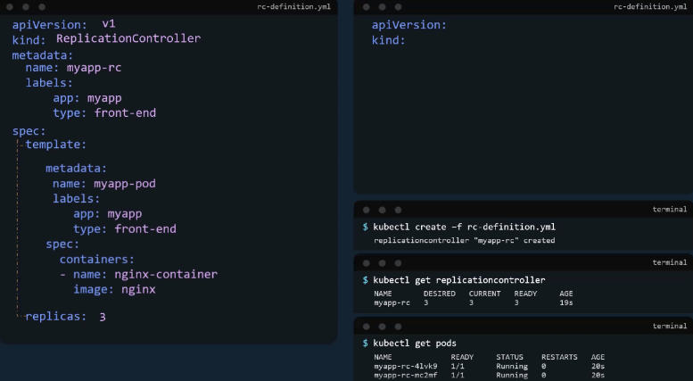
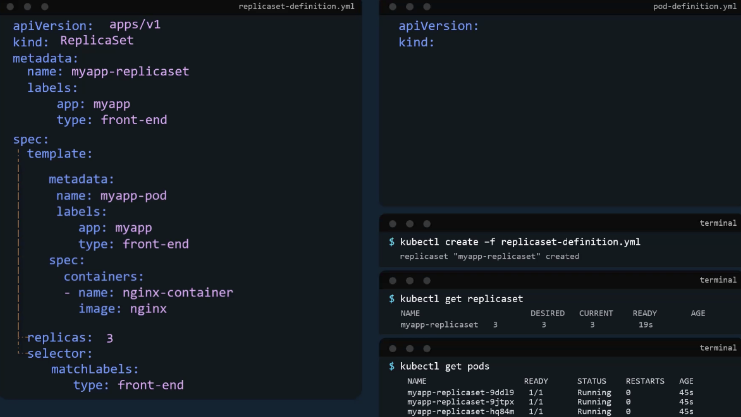

# Replication Controllers

## Commands Review

`kubectl create -f <replicaset-definition.yaml>` - Used to create a replica set or any obejct in Kubernetes depending on the file we are providing as input. 

## Replication Controller

Controllers are the brains behind Kubernetes. They are the processess that monitor Kubernetes objects and respond accordingly. 
The replication controller helps us run multiple instances of a single pod in the Kubernetes cluster. 

### Replication Controller vs Replicaset

**Replication Controller is the older technology that is being replaced by replica sets.** <br>
**Replicaset is the new recommended way to set up a replication controller.**

## Creating a Replication Controller Definition File

The API version is specific to what we are creating
- Replication controller is support inKubernetes API version v1

User the *replica* key to determine how many replicas we need in the replication controller. <br>
Once the file is completed run the `kubectl create -f <rc-definition.yaml>`



## Replica Set

Requires a selector definition (One of the main differences) <br>
- Helps the replica set identify what pods fall under it. 
- Needed because replicaset can also manage pods that we not created as part of the replica set creation. 
The match labels selector simply matches the labels specified under it to the labels on the pods. 

## Labels and Selectors

The role of the replicaset is to minotr pods and if any of them were to fail, deploy new ones. 
How does the replica set know which pods to monitor?
- Labeling Pods
- You can provide these labels as a filter for the replicasets. 



## Updating Replica Sets - Scaling

Update the number of replicas in the definition file. 
`kubectl apply -f <replicaset-definition.yaml>`
Run the `kubectl scale` command and specify the same file as input. 
`kubectl scale --replicas=6 -f <replicaset-definition.yaml>`
`kubectl scale --replicas=6 <replicaset myapp-replicaset`

Note. Using the file name as input will not result in the number of replicas being updated automatically in the file. 
- The number of replicas in the replica set definition will still be *x*, even though you called it to have *y* replicas using the kube control command and the file as input. 

## Replica Set Demo

Note. The labels used at the top of the replica set itself doesn't matter. <br>
The labels that are set on the pod and the one set on the selector matters. **It's what ties them together**

```
apiVersion: apps/v1
kind: ReplicaSet
metadata:
  name: myapp-replicaset
  labels:
    app: myapp
spec:
  selector:
    matchLabels:
      app: myapp
  replicas: 3
  template:
  metadata:
    name: nginx-2
    labels:
      app: myapp
  spec:
    containers:
      - name: nginx-2
        image: nginx-2
```

When you run ```kubectl edit replicaset``` in terminal it opens up in a text editor format, in our case, Vim. 
- This is a temporary file that is create by Kubernetes in memory, to allow us to edit the configuration of an existing object on Kubernetes. 
- Changes made to this file are directly applied on the running configuation on the cluster as soon as the file is saved. 
Note. **Be careful with the changes made here.**