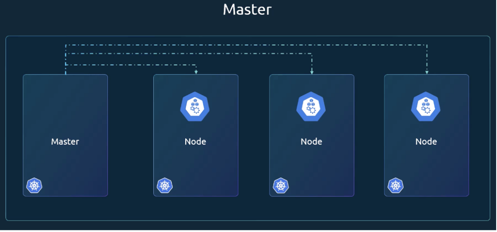

# Section 1: Highlevel Overview 

With docker you can run each component in a separate container, with its own dependencies and its own libraries all on the same Virtual Machine and the OS, but within separate environments or containers. 

### What Can Containers Do?

Containerize Applications - Run each service with its own dependencies in separate containers. 

### Understanding Containers

Containers are complete isolated environments. 
They can have their own processes or services, their own mounts, just like virtual machiens, except they all share the same OS Kernel. 

#### Types of Containers
- LXC 
- LXD 
- LCFs

Docker utilizes LXC containers. Setting up these containers cab be difficult which is where Docker comes in. 
Docker offers a high level tool with several powerful functionalities, making it easy for end users. 

### Reviewing the Operating System 

If you look at an operating system like Ubuntu, Fedora, Susi, CentOS, they all consist of two things. 
- OS Kernel
- A set of software

The OS Kernel is responsible for interacting with the underlying hardware, while the OS kernel remains the same, which is Linux. It is the software that makes these operating systems different. 
> The software may consist of different user interface drivers, compilers, file managers, developer tools, etc. 

In Summary, you have a common Linux kernel shared across all OSes and some custom software that differentiate operating systems from each other. 

Docker Containers share the underlying kernel. Docker utilizes the underlying kernel of the Docker host which works with all OSs above. 

- When you install Docker on Windows and run a Linux container on widnows, you're not really running a Linux container on windows. 

- Windows runs a Linux container on a Linux Virtual Machine under the hood. So it's really a Linux container on a Linux virtual machine on windows. 

Docker is not meant to virtualize and run different operating systems and kernels on the same hardware. 

> The Main purpose of Docker is to package and containerize various applications and to ship them and to run them anywhere, anytime, as many times as you want. 

## Containers vs Virtual Machines

Virtual Machines → OS → Dependencies → Application
- The overhead causes higher utilization of underlying resources as there are multiple operating systems and kernels. 

- Running the virtual machines also consumes higher disk space, as each VM is heavy and is usually gigabytes in size, whereas Docker containers are lightweight and are usually in megabytes in size. 

- This allows Docker containers to boot up faster, usually in a matter of seconds, whereas VMs, take minutes to boot up the entire operating system. 

- Docker has less isolation as more resources are shared between the containers, like the kernel, whereas Virtual Machines have complete isolation from each other since VMs don't rely on the underlying OS or Kernel.

When you have large environments with thousands of application containers running on thousands of docker hosts, you will often see containers provisioned on virtual docker hosts. 

- We can use the benefits of virtualization to easily provision or decommission Docker hosts as required. 

- At the same time, make use of the benefits of Docker to easily provision applications and quickly scale them as required. 

Most organizations have their products containerized and available in a public Docker repository called Docker Hub or Docker Store. 

- You can find images of most common operating systems, Databases and other services and tools. 

- Once you identify the images you need and you install Docker on your host, bringing up an application is as easy as running a `docker run` command with the name of the image. 

- Similarly, run an instance of MongoDB, Redis, and Node.js using the docker run command. 

- If you need to run multiple instances of the wbe service, simply add as many instances as you need and configure a load balancer of some kind in the front. 

- If instances were fail, simply destroy that instance and launch a new one. 
  - `docker run ansible`

  -  `docker run mongodb`

  - `docker run redis`

  - `docker run nodejs`

### Difference Between Images and Containers

#### Image
A Package or a Template, just like a virtual machine template. It is used to create one or more containers.

#### Containers
Running Instances of Images that are isolated and have their own environments and set of process. 

With Docker, developers and oeprations teams work hand in hand to transform their application into a Docker file with both of their requirements. 

- The image can now run on any host with Docker install on it, and is guaranteed to run the same way everywhere, so the ops team can now simply use the image to deploy the application. 

### Container Orchestration

If your container relies on other containers, such as databases or messaging services or other backend services. 

If you need to need to scale down when load decreaes or scale up your application with increased users. 

- You need an underlying platform with a set of resources and capabilities. 

- The platform needs to orchestrate the connectivity between the containers and automatically scale up or down based on the load. 

#### Container Orchestration
Refers to the entire process of automatically deploying and managing containers. 
> Kubernetes is just a container orchestration technology. 

There are multiple technologies such as:
- *Docker Swarm* - Docker
  - Easy to setup and get started but it lacks some of the advacned features required for complex applications. 
- *Mesos* - Apache
	- Quite difficult to set up and get started, but supports many advanced features. 
- *Kubernetes* - Google
	- Now supported on all public cloud service providers such as GCP, Azure, and AWS and is one of the top ranke dprojects in Github. 

#### Advantages of Container Orchestration

1. Your application is now highly available as hardware failures do not bring your application down because you have multiple instances of your application running on different nodes. 

2. The user traffic is load balanced across the various containers. 
	  - When demand increases deploy more instances of the application seamlessly and within a matter of seconds. 
		- We have the ability to do that at a service level when we run out of hardware resources.
		- Scale the number of underlying nodes up or down without having to take down the application, and do all of these easily with a set of declarative object configuration files. 

### Architecture

**Node** - A machine, physical or virtual (On which Kubernetes is installed). 
- A worker machine where containers will be launched by Kubernetes

**Cluster** - A set of nodes grouped together. 
- That way if one fails, you have your application still accessible from the other nodes. 
- Helps balance loads.

**Master** - Another node with Kubernetes installed that watches over the node cluster and is responsible for the actual orchestration of containers on the worker nodes. 

### Compnents 

When you install Kubernetes on a system, you're actually installing the following components:
- API Server
- ETCD Service
- Kubelet Service
- A Container Runtime
- Runtime Controllers
- Schedulers

#### API Server
Acts as the front end of Kubernetes. The user's management devices, command line interfaces all talk to the API server to interact with the Kubernetes cluster. 

#### ETCD Keystore
ETCD is a distributed, reliable key value store used by Kubernetes to store all data used to manage the cluster. 
- ETCD is respoinsible for implementing locks within the cluster to ensure that there are no conflicts between masters. 

